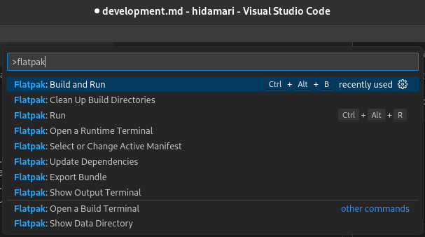

# Development Note

Hidamari can be built using two methods: "Build and Install" and "Build as Flatpak."

1. **Build and Install**
   - This method requires you to have dependencies installed on your system.
   - It installs all components, including scripts, icons, and desktop file, into the `/usr/local/*` directory.
   - If your distro has the necessary packages, 'Build and Install' is the quickest Hidamari setup

2. **Build as Flatpak**
   - This method doesn't require you to have dependencies installed on your system.
   - Instead, it downloads all the dependencies and builds them into a container.
   - The initial build for Flatpak may take longer, as it needs to build all the required dependencies.
   - Building as a Flatpak is recommended if you want to maintain an isolated development environment.

Choose the method that best suits your development needs.

## Build and Install
### Dependencies
#### PyGObject
Please refer to the [official documentation](https://pygobject.readthedocs.io/en/latest/getting_started.html#gettingstarted). The system-provided PyGObject is recommended.

#### Python packages
- Installing with pip (from `requirements.txt`, recommended)
```bash
pip install -r requirements.txt
```

- Installing from system provided package (Fedora):
```bash
sudo dnf install python3-pillow python3-pydbus python3-requests python3-setproctitle python3-vlc yt-dlp
```

#### Runtime dependencies
Note 1: Packages may have different names among distros. Hint: [pkgs.org](https://pkgs.org/) is very convenient to search packages for your distro.

Note 2: Please don't worry about the `gnome-desktop` package; it's just a library, not the GNOME Desktop Environment. 

- Ubuntu:
```bash
sudo apt install dconf-cli libappindicator3-1 libgnome-desktop-4-1 libwebkit2gtk-4.1-0 libwnck-3-0 mesa-utils vdpauinfo xdg-user-dirs
```

- Fedora:
```bash
sudo dnf install dconf glx-utils gnome-desktop4 libappindicator-gtk3 libwnck3 vdpauinfo webkit2gtk4.1 xdg-user-dirs
```

#### Build dependencies
- Ubuntu:
```bash
sudo apt install git meson gtk-update-icon-cache desktop-file-utils
```

- Fedora:
```bash
sudo dnf install git meson gtk-update-icon-cache desktop-file-utils
```

### Install
```bash
meson setup build && meson install -C build
```

### Uninstall
Please, check these commands before running. 🙏
```bash
sudo rm -rf /usr/local/share/hidamari
sudo rm /usr/local/bin/hidamari
sudo rm /usr/local/share/appdata/io.github.jeffshee.Hidamari.appdata.xml
sudo rm /usr/local/share/applications/io.github.jeffshee.Hidamari.desktop
sudo rm /usr/local/share/glib-2.0/schemas/io.github.jeffshee.Hidamari.gschema.xml
sudo rm /usr/local/share/icons/hicolor/scalable/apps/io.github.jeffshee.Hidamari.svg
```

## Build as Flatpak
### Environment Setup
First, please make sure you have `flatpak` and `flatpak-builder` installed on your system. For more details, please refer to the [Flatpak official documentation](https://docs.flatpak.org/en/latest/first-build.html).

For Flatpak development, VSCode with the Flatpak extension (`bilelmoussaoui.flatpak-vscode`) is recommended. Alternatively, GNOME Builder is also useful when building Flatpak applications.

When cloning the Hidamari repo, you should pull the submodules as well (`shared-modules`) as it is required for building Flatpak.

To do so, use `--recurse-submodules` when cloning:
```bash
git clone --recurse-submodules https://github.com/jeffshee/hidamari.git
```
Alternatively, if you've already cloned the repo, use the following command:
```bash
git submodule update --init --recursive
```
### Build and Run
Building Flatpak with the mentioned extension is straightforward. Simply press <kbd>F1</kbd> (command palette), search for "flatpak", and you will find all the available actions you can perform. The rest is self-explanatory.


